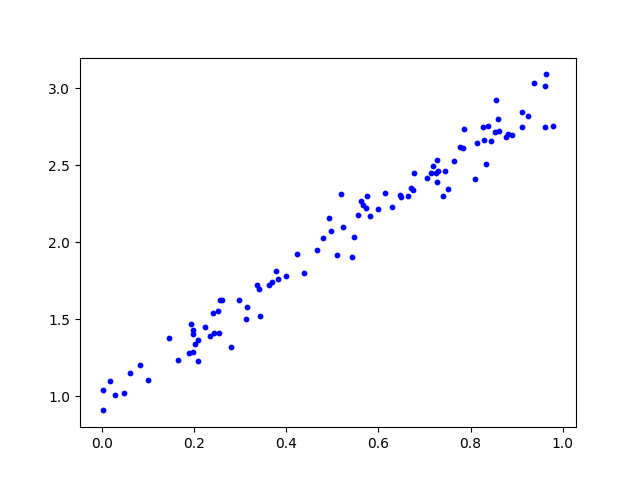
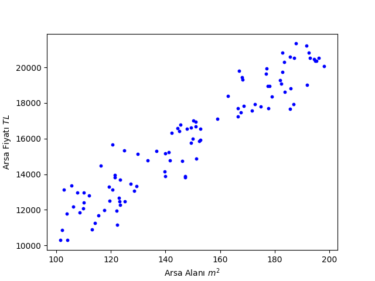
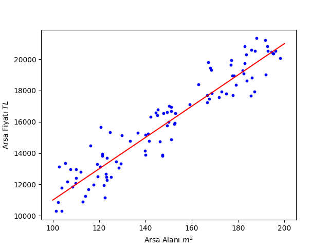

# Least Squares Method

## Önsöz

Merhaba arkadaşlar, girizgah önemli olduğu için bu haftaki materyali kendim hazırlamaya karar verdim, bu sayede eğitim grubunun devamında karşımıza çıkacak kavramları size daha iyi aktarabileceğimi düşündüm.

Materyalin genelinde $\mathcal{D} = \{x^{(i)}\}_1^N, x^{(i)} \in \mathbb{R}^2$ örneği gibi **matematiksel notasyon** kullanımı ile sık sık karşılaşacaksınız, her ne kadar basit kavramları anlatırken pek ihtiyacımız olmasa da günün sonunda matematiksel notasyon okur yazarlığımız olması önemli, bir noktadan sonra kavramları başka şekilde anlatmanın pratik bir yolu kalmıyor. Bu yazıda aynı zamanda size sıkça kullanacağımız bazı notasyonları da göstermeye çalışacağım, sizden ricam onları da asıl materyal gibi önemseyip kafanızda oturtmaya çalışmanız.

## Nedir?

**Least Squares Method**, genel olarak yapay zeka temalı birçok dersin olmazsa olmazlarından olan bir yöntem. İleride karşımıza çıkacak birçok kavramı basit bir şekilde kullanmamız açısından güzel bir örnek.

Elinizde $D$ boyutlu $N$ adet vektör olduğunu düşünün. Örneğin $D = 2$ ve $N = 100$ ise bu elimizde $(x, y)$ gibi gösterebileceğimiz $100$ adet nokta var demek. Burada önemli bir detay, çoğu zaman **vektör** ve **nokta** terimleri birbirinin yerine kullanılabiliyor, yani basitçe elimizde hepimizin bildiği 2 boyutlu bir koordinat sistemindeki noktalar var diyebiliriz.

Bunu göstermenin alternatif bir yolu da elimizde $\mathcal{D} = \{x^{(i)}\}_{i=1}^{100}, x^{(i)} \in \mathbb{R}^2$ olmak üzere bir veri kümesi (**dataset**) olduğunu söylemek. $D$ ve $N$'i genel hali ile bırakmak istersek ise $\mathcal{D} = \{x^{(i)}\}_{i=1}^{N}, x^{(i)} \in \mathbb{R}^D$ diyebiliriz.

Buraya kadar her şey güzel, peki bu tür bir veri kümesi ile karşılaşabileceğimiz gerçek bir senaryo ne olabilir? Yine 2 boyutlu bir örnek üstünden gidelim, örneğin İstanbul'daki belli sayıda arsa için elimizde arsanın alanı ve satış fiyatı olsun.

Sayılara takılmamaya çalışın :) Peki, elimizde bu data mevcut ve elimize yeni bir arsa geldiği zaman fiyatını tahmin etmek istiyoruz, bu durumda ne yapabiliriz? İşte burada **Least Squares Method** devreye giriyor.

Eğer elimizde kırmızı ile gösterilen doğrunun denklemi varsa, yeni bir arsa için sadece arsanın alanını bilerek bir fiyat tahmini yapabiliriz. Least Squares Method bizim bu doğruyu bulmamızı sağlıyor.

Formal bir tanım yapacak olursak: Elimizde $\mathcal{D} = \{x^{(i)}\}_{i=1}^{N}, x^{(i)} \in \mathbb{R}^{D+1}$ veri kümesi olsun, yani elimizdeki her bir vektör $D+1$ boyutlu, örneğin vektörlerimizin her bir elemanı **alan**, **fiyat**, **en**, **boy** gibi özellikleri tanımlıyor olabilir, $x^{(i)} \in \mathbb{R}^{D+1}$ dediğimizde ise bu elemanların birer reel sayı olduğunu ifade ediyor.

Daha açık söylemek gerekirse $x^{(1)}$, $x^{(2)}$, ..., $x^{(N)}$ gibi isimlendirilen, elimizdeki her bir vektör $D+1$ adet reel sayı ile ifade ediliyor. Az önce $D$ derken şimdi $D+1$ demem kafanızı karıştırmasın, bir sonraki adımı daha anlaşılır kılmak için yaptığım bir değişiklik.

Şimdi her bir vektör için bu $D+1$ adet reel sayıdan bir tanesini kenara ayıralım (örneğin arsanın fiyatı) ve bunlardan yeni bir küme oluşturalım:

$\mathcal{Y} = \{y^{(i)}\}_{i=1}^{N}, y^{(i)} \in \mathbb{R}$

Her bir vektörden sadece tek bir elemanı ayırdığımız için yeni kümemizdeki elemanlar da sadece tek boyutlu, bu yüzden $y^{(i)} \in \mathbb{R}$ diyebiliyoruz. Örneğin önceden elimizde (**alan**, **fiyat**, **en**, **boy**) şeklinde vektörler varken, şimdi elimizde (**alan**, **en**, **boy**) ve ( **fiyat** ) olmak üzere iki ayrı çeşit vektör var.

Artık elimizde iki adet küme var:

$\mathcal{D} = \{x^{(i)}\}_{i=1}^{N}, x^{(i)} \in \mathbb{R}^{D}$ ve $\mathcal{Y} = \{y^{(i)}\}_{i=1}^{N}, y^{(i)} \in \mathbb{R}$

İşte bu yüzden $D$ yerine $D+1$ demiştim :) Karışık görünüyor olabilir ama aslında çok basit, elimizdeki veri kümesini iki parçaya ayırdık, bir tanesi özellikleri içeriyor, diğeri ise fiyatları içeriyor ve elbette $x^{(i)}$ özelliklerine karşılık gelen $y^{(i)}$ fiyatı ile eşleşiyor, yani $x^{(1)}$ özelliklerine sahip arsanın fiyatı $y^{(1)}$, $x^{(2)}$ özelliklerine sahip arsanın fiyatı $y^{(2)}$ ve böyle devam ediyor.

Değişken isimleri ve bir tık karmaşık bazı matematiksel zamazingolar ile kafanızı şişirdiğim için kusuruma bakmayın :) Ama inanın her şey sizin iyiliğiniz için.

Şimdi her şeyin yerli yerine oturması için asıl örneğimizde bu yeni kümeleri tanımlayalım. Öncelikle elimizdeki veri kümesi:

Bu veri kümesini $\mathcal{D} = \{x^{(i)}\}_{i=1}^{100}, x^{(i)} \in \mathbb{R}^2$ şeklinde tanımlamıştık, az önce yaptığımız gibi iki parçaya ayırdığımızda ise elimizde:

$\mathcal{D} = \{x^{(i)}\}_{i=1}^{100}, x^{(i)} \in \mathbb{R}$ ve $\mathcal{Y} = \{y^{(i)}\}_{i=1}^{100}, y^{(i)} \in \mathbb{R}$

şeklinde iki küme oluyor. Yani bir küme sadece arsa alanlarını içerirken, diğeri ise sadece fiyatları içeriyor. Artık problemimizi daha kolay bir şekilde ifade edebiliriz, herhangi bir $x^{(i)}$ için $y^{(i)}$'yi tahmin etmek istiyoruz, yani herhangi bir arsanın alanı bilindiğinde fiyatını tahmin etmek istiyoruz. Tabii ki $x^{(i)}$ 1 boyutlu olmak zorunda değildi, alan bilgisinin yanında daha bir sürü özelliği de içinde barındırabilirdi, bu yüzden genel senaryo için $x^{(i)} \in \mathbb{R}^D$ diyoruz. Ama eğer bu örnekte $D$'yi 1'den büyük bir sayı belirleseydik, görselleştirmemiz oldukça zorlaşacaktı, hadi 2 olsa yine bir şekilde yapardık ama 3'ten sonrasını görsel olarak kafasında canlandıran varsa helal olsun :) (Unutmayın $x$'in 3 elemanı yanında bir de karşılık olarak $y$'nin 1 elemanı var, yani 4 boyutlu bir uzaydan bahsediyoruz)

Şimdi elle tutulur şeylere geri dönelim, ne demiştik:

Kırmızı doğruyu çizersek, problemi çözeriz. Kağıt kalem ile yapması oldukça kolay, ama bahsettiğimiz $D$'nin $1$ olmadığı senaryolar için biraz daha matematiksel düşünelim. En nihayetinde elde etmek istediğimiz şey, herhangi bir arsa alanı için bu arsanın fiyatını kusursuz bir şekilde tahmin etmek, elbette arsanın sadece alanını biliyorsak bu oldukça zor bir iş, hatta daha fazla bilgimiz olsa bile, hayatta her şey rasyonel değil, birileri arsasını çok uzuca veya çok pahalıya satıyor olabilir, gerçek hayatta karşımıza çıkan bu tür keyfi oynamalara __noise__ yani __gürültü__ deriz. Yani kusursuz tahmin için çok da heveslenmemekte fayda var, ama biz yine de elimizden geleni yapalım.

Daha da basitleştirmek istersek, elimizde $1$ adet reel sayı var ve bir buna karşılık başka $1$ reel sayıyı tahmin etmek istiyoruz. Bu bize çok iyi bildiğimiz bir yapıyı anımsatıyor: __fonksiyonlar__.

İdeal bir dünyada sihirli bir şekilde öyle bir $f(x)$ fonksiyonu elde edebiliriz ki, $f(x^{(1)}) = y^{(1)}$ olur, $f(x^{(2)}) = y^{(2)}$ olur, $f(x^{(3)}) = y^{(3)}$ olur ve böyle devam eder. Elimizde bu fonksiyon varsa, fiyatını bilmeyip alanını bildiğimiz herhangi bir arsa için, bu fonksiyona alanı verdiğimizde fiyatını tahmin edebiliriz.