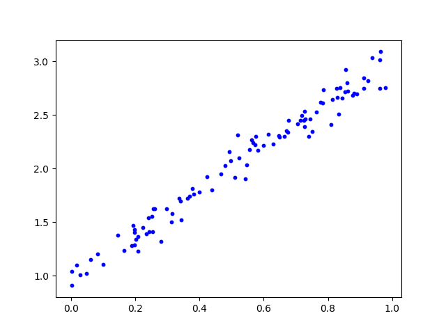
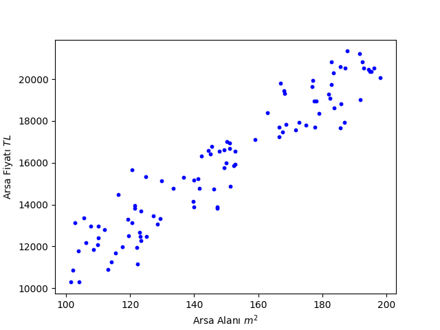

# Least Squares Method

## Önsöz

Merhaba arkadaşlar, girizgah önemli olduğu için bu haftaki materyali kendim hazırlamaya karar verdim, bu sayede eğitim grubunun devamında karşımıza çıkacak kavramları size daha iyi aktarabileceğimi düşündüm.

Materyalin genelinde $\mathcal{D} = \{x^{(i)}\}_1^N, x^{(i)} \in \mathbb{R}^2$ örneği gibi **matematiksel notasyon** kullanımı ile sık sık karşılaşacaksınız, her ne kadar basit kavramları anlatırken pek ihtiyacımız olmasa da günün sonunda matematiksel notasyon okur yazarlığımız olması önemli, bir noktadan sonra kavramları başka şekilde anlatmanın pratik bir yolu kalmıyor. Bu yazıda aynı zamanda size sıkça kullanacağımız bazı notasyonları da göstermeye çalışacağım, sizden ricam onları da asıl materyal gibi önemseyip kafanızda oturtmaya çalışmanız.

## Nedir?

**Least Squares Method**, genel olarak yapay zeka temalı birçok dersin olmazsa olmazlarından olan bir yöntem. İleride karşımıza çıkacak birçok kavramı basit bir şekilde kullanmamız açısından güzel bir örnek.

Elinizde $D$ boyutlu $N$ adet vektör olduğunu düşünün. Örneğin $D = 2$ ve $N = 100$ ise bu elimizde $(x, y)$ gibi gösterebileceğimiz $100$ adet nokta var demek. Burada önemli bir detay, çoğu zaman **vektör** ve **nokta** terimleri birbirinin yerine kullanılabiliyor, yani basitçe elimizde hepimizin bildiği 2 boyutlu bir koordinat sistemindeki noktalar var diyebiliriz.



Bunu göstermenin alternatif bir yolu da elimizde $\mathcal{D} = \{x^{(i)}\}_{i=1}^{100}, x^{(i)} \in \mathbb{R}^2$ olmak üzere bir veri kümesi (**dataset**) olduğunu söylemek. $D$ ve $N$'i genel hali ile bırakmak istersek ise

$\mathcal{D} = \{x^{(i)}\}_{i=1}^{N}, x^{(i)} \in \mathbb{R}^D$ diyebiliriz.

Buraya kadar her şey güzel, peki bu tür bir veri kümesi ile karşılaşabileceğimiz gerçek bir senaryo ne olabilir? Yine 2 boyutlu bir örnek üstünden gidelim, örneğin İstanbul'daki belli sayıda arsa için elimizde arsanın alanı ve satış fiyatı olsun.



Sayılara takılmamaya çalışın :) Peki, elimizde bu data mevcut ve elimize yeni bir arsa geldiği zaman fiyatını tahmin etmek istiyoruz, bu durumda ne yapabiliriz? İşte burada **Least Squares Method** devreye giriyor.


Eğer elimizde kırmızı ile gösterilen doğrunun denklemi varsa, yeni bir arsa için sadece arsanın alanını bilerek bir fiyat tahmini yapabiliriz. Least Squares Method bizim bu doğruyu bulmamızı sağlıyor.

Formal bir tanım yapacak olursak: Elimizde $\mathcal{D} = \{x^{(i)}\}_{i=1}^{N}, x^{(i)} \in \mathbb{R}^{D+1}$

veri kümesi olsun, yani elimizdeki her bir vektör $D+1$ boyutlu, örneğin vektörlerimizin her bir elemanı **alan**, **fiyat**, **en**, **boy** gibi özellikleri tanımlıyor olabilir, $x^{(i)} \in \mathbb{R}^{D+1}$ dediğimizde ise bu elemanların birer reel sayı olduğunu ifade ediyor.

Daha açık söylemek gerekirse $x^{(1)}$, $x^{(2)}$, ..., $x^{(N)}$ gibi isimlendirilen, elimizdeki her bir vektör $D+1$ adet reel sayı ile ifade ediliyor. Az önce $D$ derken şimdi $D+1$ demem kafanızı karıştırmasın, bir sonraki adımı daha anlaşılır kılmak için yaptığım bir değişiklik.

Şimdi her bir vektör için bu $D+1$ adet reel sayıdan bir tanesini kenara ayıralım (örneğin arsanın fiyatı) ve bunlardan yeni bir küme oluşturalım:

$\mathcal{Y} = \{y^{(i)}\}_{i=1}^{N}, y^{(i)} \in \mathbb{R}$

Her bir vektörden sadece tek bir elemanı ayırdığımız için yeni kümemizdeki elemanlar da sadece tek boyutlu, bu yüzden $y^{(i)} \in \mathbb{R}$ diyebiliyoruz. Örneğin önceden elimizde (**alan**, **fiyat**, **en**, **boy**) şeklinde vektörler varken, şimdi elimizde (**alan**, **en**, **boy**) ve ( **fiyat** ) olmak üzere iki ayrı çeşit vektör var.

Artık elimizde iki adet küme var:

$\mathcal{D} = \{x^{(i)}\}_{i=1}^{N}, x^{(i)} \in \mathbb{R}^{D}$ ve

$\mathcal{Y} = \{y^{(i)}\}_{i=1}^{N}, y^{(i)} \in \mathbb{R}$

İşte bu yüzden $D$ yerine $D+1$ demiştim :) Karışık görünüyor olabilir ama aslında çok basit, elimizdeki veri kümesini iki parçaya ayırdık, bir tanesi özellikleri içeriyor, diğeri ise fiyatları içeriyor ve elbette $x^{(i)}$ özelliklerine karşılık gelen $y^{(i)}$ fiyatı ile eşleşiyor, yani $x^{(1)}$ özelliklerine sahip arsanın fiyatı $y^{(1)}$, $x^{(2)}$ özelliklerine sahip arsanın fiyatı $y^{(2)}$ ve böyle devam ediyor.

Değişken isimleri ve bir tık karmaşık bazı matematiksel zamazingolar ile kafanızı şişirdiğim için kusuruma bakmayın :) Ama inanın her şey sizin iyiliğiniz için.

Şimdi her şeyin yerli yerine oturması için asıl örneğimizde bu yeni kümeleri tanımlayalım. Öncelikle elimizdeki veri kümesi:


Bu veri kümesini $\mathcal{D} = \{x^{(i)}\}_{i=1}^{100}, x^{(i)} \in \mathbb{R}^2$ şeklinde tanımlamıştık, az önce yaptığımız gibi iki parçaya ayırdığımızda ise elimizde:

$\mathcal{D} = \{x^{(i)}\}_{i=1}^{100}, x^{(i)} \in \mathbb{R}$ ve

$\mathcal{Y} = \{y^{(i)}\}_{i=1}^{100}, y^{(i)} \in \mathbb{R}$

şeklinde iki küme oluyor. Yani bir küme sadece arsa alanlarını içerirken, diğeri ise sadece fiyatları içeriyor. Artık problemimizi daha kolay bir şekilde ifade edebiliriz, herhangi bir $x^{(i)}$ için $y^{(i)}$'yi tahmin etmek istiyoruz, yani herhangi bir arsanın alanı bilindiğinde fiyatını tahmin etmek istiyoruz. Tabii ki $x^{(i)}$ 1 boyutlu olmak zorunda değildi, alan bilgisinin yanında daha bir sürü özelliği de içinde barındırabilirdi, bu yüzden genel senaryo için $x^{(i)} \in \mathbb{R}^D$ diyoruz. Ama eğer bu örnekte $D$'yi 1'den büyük bir sayı belirleseydik, görselleştirmemiz oldukça zorlaşacaktı, hadi 2 olsa yine bir şekilde yapardık ama 3'ten sonrasını görsel olarak kafasında canlandıran varsa helal olsun :) (Unutmayın $x$'in 3 elemanı yanında bir de karşılık olarak $y$'nin 1 elemanı var, yani 4 boyutlu bir uzaydan bahsediyoruz)

Şimdi elle tutulur şeylere geri dönelim, ne demiştik:


Kırmızı doğruyu çizersek, problemi çözeriz. Kağıt kalem ile yapması oldukça kolay, ama bahsettiğimiz $D$'nin $1$ olmadığı senaryolar için biraz daha matematiksel düşünelim. En nihayetinde elde etmek istediğimiz şey, herhangi bir arsa alanı için bu arsanın fiyatını kusursuz bir şekilde tahmin etmek, elbette arsanın sadece alanını biliyorsak bu oldukça zor bir iş, hatta daha fazla bilgimiz olsa bile, hayatta her şey rasyonel değil, birileri arsasını çok uzuca veya çok pahalıya satıyor olabilir, gerçek hayatta karşımıza çıkan bu tür keyfi oynamalara __noise__ yani __gürültü__ deriz. Yani kusursuz tahmin için çok da heveslenmemekte fayda var, ama biz yine de elimizden geleni yapalım.

Daha da basitleştirmek istersek, elimizde $1$ adet reel sayı var ve bir buna karşılık başka $1$ reel sayıyı tahmin etmek istiyoruz. Bu bize çok iyi bildiğimiz bir yapıyı anımsatıyor: __fonksiyonlar__.

İdeal bir dünyada sihirli bir şekilde öyle bir $f(x)$ fonksiyonu elde edebiliriz ki, $f(x^{(1)}) = y^{(1)}$ olur, $f(x^{(2)}) = y^{(2)}$ olur, $f(x^{(3)}) = y^{(3)}$ olur ve böyle devam eder. Elimizde bu fonksiyon varsa, fiyatını bilmeyip alanını bildiğimiz herhangi bir arsa için, bu fonksiyona alanı verdiğimizde fiyatını tahmin edebiliriz. Peki bu fonksiyonu nasıl elde edeceğiz?

Yine bildiğimiz basit gerçeklere dönelim, kırmızı doğruyu hatırlayın:


2 boyutlu bu doğrunu denkleminin neye benzeyeceğini çok iyi biliyoruz: $f(x) = a \times x + b$

Yani aslında bulmamız gereken $2$ adet değişken var, $a$ ve $b$. İnsan dili ile ifade etmemiz gerekirse eğim ve y eksenini kestiği nokta. Şimdi gelin makine öğrenmesindeki en temel kavramlardan bir tanesini tanıyalım ve çözüme bir adım daha yaklaşalım: __Error Function__ yani __hata fonksiyonu__. 

Makine öğrenmesinde uyguladığımız en temel stratejilerden biri, çok kötü bir tahmin fonksiyonunu alıp adım adım iyileştirmek. Ne mi demek istiyorum? Diyelim elimizde arsa fiyatı tahmini için bir fonksiyon var ve adı $g(x)$. 

Peki elimizde $g(x)$ var, ve gerçekten de ona bir arsanın alanını söylediğimizde bize fiyatla ilgili bir tahmin yapıyor. Peki $g(x)$'in genel olarak ne kadar başarılı olduğunu nasıl anlayacağız? Evet elimizde az sayıda örnek varsa tek tek hesaplayıp bakabiliriz ama tahmin edeceğiniz gibi bu pek de iyi bir fikir değil.

Şu işimizi çok daha kolaylaştırırdı, öyle bir fonksiyon var ki, ben elimdeki $g(x)$ fonksiyonunun yaptığı tahminleri ona verince bana pozitif bir reel sayı döndürüyor, bu sayı da $g(x)$'in ne kadar başarılı olduğunu gösteriyor. Bu sayı ne kadar küçükse, $g(x)$ o kadar başarılı demek. Bu sayıya __error__ (__hata__) diyoruz, yani $g(x)$'in yaptığı tahminlerin ne kadar yanlış olduğunu gösteren bir sayı.

Diyelim ki $\mathcal{D} = \{x^{(i)}\}_{i=1}^{100}, x^{(i)} \in \mathbb{R}$ veri kümesindeki tüm $x^{(i)}$'leri $g(x)$'e veriyoruz ve hepsi için bir tahmin alıyoruz, bu tahminleri $\hat{y}^{(i)}$ şeklinde isimlendirelim. Yani $g(x^{(i)}) = \hat{y}^{(i)}$. Dikkat edin $\hat{y}$'nin üzerinde bir şapka var.

Şimdi asıl noktaya geliyoruz, $\hat{y}^{(i)}$ bizim tahminimiz, $y^{(i)}$ ise gerçek değer, tüm $i$'ler için bu iki değer eşit olsaydı, bu $g(x)$'in kusursuz çalıştığını gösterirdi, yani bu __hata__ dediğimiz şeyi hesaplamanın bir yolunu bilseydik, hatanın $0$ olmasını beklerdik.

O zaman şöyle bir şey yapalım, her bir $i$ için $y^{(i)} - \hat{y}^{(i)}$ hesaplayalım ve bunları toplayalım, $g(x)$'in kusursuz çalıştığı senaryoda bu değer gerçekten de 0 gelirdi. Ama burada bir şey ters, değerlerin eşit olmadığı senaryoda $\hat{y}^{(i)}$ büyüdükçe toplam değer küçülür, yani hata azalır, ama durum bu değil, çünkü $\hat{y}^{(i)}$ büyüyorsa $y^{(i)}$ ile arasındaki fark açılıyor demek! Bu yüzden $y^{(i)} - \hat{y}^{(i)}$'nin mutlak değerini alıp toplamak daha mantıklı, yani $|y^{(i)} - \hat{y}^{(i)}|$, işte bu bize gerçekten de tahmin edilen fiyatlar ve gerçek fiyatların birbirine ne kadar benzediğini gösterir. Benzerlerse değer küçük olur, değillerse değer büyük olur. Ve fark edeceğiniz üzere bizim eşde etmek istediğimiz __hata fonksiyonu__'nun tam olarak bunu yapması gerekiyor! O zaman fonksiyonumuzu bulduk.

$E = ∑_{i=1}^{100} |y^{(i)} - \hat{y}^{(i)}|$

Burada $E$ __error__'ın baş harfinden geliyor. Peki şimdi hatırlayın $g(x) = a \times x + b$ formunda demiştik, yani her farklı $a$ ve $b$ değeri için $g(x)$ farklı bir doğruyu ifade ediyor. Biz bu farklı doğrular arasında bize en düşük hatayı veren $g(x)$'i istiyoruz. O zaman hata fonksiyonunu $a$ ve $b$ cinsinden yazabiliriz:

$E(a, b) = ∑_{i=1}^{100} |y^{(i)} - (a \times x^{(i)} + b)|$

Burada $E$'nin yanına $a$ ve $b$ yazdık, çünkü $E$'nin $a$ ve $b$'ye bağlı olduğunu belirtmek istiyoruz, en nihayetinde datamız yani arsalara karşılık gelen alan ve fiyat ikilileri değişmiyor, değişen şey $a$ ve $b$ yani datamıza uygun olacak şekilde değiştireceğimiz değişkenler.

Bu noktada şunu belirtmekte fayda var, makine öğrenmesi gibi matematik temeli yoğun alanlarda, en basit yöntem için bile tüm işlemleri, denklemleri, değişkenleri sürekli aklımızda tutmamız çok mümkün olmayabilir. O yüzden bu noktada baştan sona tüm aşamalar aklınızda değilse endişe etmeyin. Önemli olan aşamalar arası her bir ufak geçişi anlamak, eğer şu noktaya kadar her bir adımı anladıysanız, başta elimizde olan şey ile şu an elimizde olan şey arasında direkt bir bağlantı görmenize gerek yok, en nihayetinde her bir adımdan tek tek eminseniz, şu an elinizdeki şey doğru demektir.

Peki dediğimiz gibi burada verimiz sabit, yani elimizde aynı 100 adet arsa, arsaların alanları ve fiyatları var, yani aslında __hata fonksiyonu__'muz için $x^{(i)}$ ve $y^{(i)}$ sabit. __Hata fonksiyonu__ sadece ve sadece $a$ ve $b$ değişkenlerine bağlı!

Bu işimizi çok ama çok kolaylaştırıyor. Elimizde bir $E(a, b)$ fonksiyonu var ve bu fonksiyonun değerini olabilecek en küçük değer yapan $a$ ve $b$ değişkenlerini bulmak istiyoruz. Ne yapmamız gerektiğini biliyorsunuz :)

Eğer $E(a, b)$'nin $a$ ve $b$'ye göre türevini alıp 0'a eşitleyip $a$ ve $b$ için denklemi çözersek, $E(a, b)$'nin $a$ ve $b$'ye göre minimum olduğu noktayı bulmuş oluruz. Kısaca hatırlayalım:

$h(a, b) = 5a^2 + 3ab + 2b^2 + 3a + 5b + 1$ olsun. $h(a, b)$'nin $a$'ya göre türevini alalım:

$\frac{\partial h(a, b)}{\partial a} = 10a + 3b + 3$ şimdi çıkan ifadeyi $0$'a eşitleyelim:

$10a + 3b + 3 = 0$ buradan $a = -\frac{3b}{10} - \frac{3}{10}$ elde ederiz. Şimdi $h(a, b)$'nin $b$'ye göre türevini alalım:

$\frac{\partial h(a, b)}{\partial b} = 3a + 4b + 5$ şimdi çıkan ifadeyi $0$'a eşitleyelim:

$3a + 4b + 5 = 0$ buradan $b = -\frac{3a}{4} - \frac{5}{4}$ elde ederiz. Şimdi sistemimizi çözelim:

$a = -\frac{3b}{10} - \frac{3}{10}$

$b = -\frac{3a}{4} - \frac{5}{4}$

Maalesef bunu adım adım yapmayacağım çünkü değerler çok saçma geliyor :) Ama 2 bilinmeyenli 2 denklemi çözmek için bildiğimiz yöntemleri kullanabiliriz, sonuç ise:

$a \approx 0.0968$ ve $b \approx -1.3226$ olacak.

Tamamen aynı mantık $E(a,b)$ fonksiyonumuz için de geçerli. Ama yine önümüzde ufak bir engel var. Pek tabii ki bunu yapmanın yolları var ama $E(a, b)$'yi mutlak değerli bir fonksiyon olarak tanımladık ve bu minimumunu bulmak için çok güzel bir fonksiyon değil. İşte bu noktada __Least Squares Method__'un adında da olan ufak bir değişiklik ile işimizi kolaylaştırabiliriz __squares__ yani __kareler__.

Hatırlarsanız mutlak değeri kullanma sebebimiz rastgele farklara bakmaktansa iki değerin birbirine ne kadar uzak olduğunu ölçmekti, bunu yapmak için illa mutlak değer kullanmak zorunda değiliz, şunu düşünün $(y^{(i)} - \hat{y}^{(i)})^2$ deseydik, yine istediğimiz özellikleri sağlamaz mıydı? Evet sağlardı, çünkü $(y^{(i)} - \hat{y}^{(i)})^2$'nin değeri her zaman pozitif ve değerler birbirine ne kadar uzaksa o kadar büyük olur. Bu yüzden __Least Squares Method__'da __squares__ yani __kareler__ kullanılıyor. O zaman __hata fonksiyonu__'muzu buna göre güncelleyelim:

$E(a, b) = ∑_{i=1}^{100} (y^{(i)} - (a \times x^{(i)} + b))^2$.

Peki, teoride bu ifadenin türevini alabileceğimizi biliyoruz, daha sonrasında $a$'ya ve $b$'ye göre türevleri $0$'a eşitlememiz gerektiğini de biliyoruz. Aslında şu an elinize kağıt kalemi alıp $a$ ve $b$ için $x^{(i)}$ ve $y^{(i)}$'e göre birer denklem çıkarabilirsiniz, fakat bu bizi çok uğraştırır. Gelin bir adım geri gidelim:

$E(a, b) = ∑_{i=1}^{100} (y^{(i)} - \hat{y}^{(i)})^2$ demiştik. Hadi bir adım daha geri gidip $100$ yerine $N$ yazalım:

$E(a, b) = ∑_{i=1}^{N} (y^{(i)} - \hat{y}^{(i)})^2$.

Elimizde oldukça yalın bir ifade var. Bunu daha da yalınlaştırmanın bir yolu olabilir mi? Mesela şu toplam sembolünden bir kurtulsak? Hafızanızı tazelemek için bir örnek düşünelim, elimde bir vektör olsun:

```math
\mathbf{v} = \begin{bmatrix} a \\ b \\ c \\ d \\ e \end{bmatrix}
```

Bu vektörü kendisi ile skaler çarpım yaparsak ne olur?

$\mathbf{v} \cdot \mathbf{v} = \mathbf{v}^T\mathbf{v} = a^2 + b^2 + c^2 + d^2 + e^2$

Yani her bir elemanın karelerinin toplamı. O halde benim elimde elemanları $y^{(i)} - \hat{y}^{(i)}$ olan bir vektör olsa:

```math
\mathbf{v} = \begin{bmatrix} y^{(1)} - \hat{y}^{(1)} \\ y^{(2)} - \hat{y}^{(2)} \\ \vdots \\ y^{(N)} - \hat{y}^{(N)} \end{bmatrix}
```
ve bu vektörü kendisi ile skaler çarpsam:

$\mathbf{v} \cdot \mathbf{v} = \mathbf{v}^T\mathbf{v} = ∑_{i=1}^{N} (y^{(i)} - \hat{y}^{(i)})^2$ 🤯🤯🤯🤯

Hatta ve hatta $Y$ ve $\hat{Y}$ olmak üzere iki vektörümüz olsa:

```math
Y = \begin{bmatrix} y^{(1)} \\ y^{(2)} \\ \vdots \\ y^{(N)} \end{bmatrix}$ ve $\hat{Y} = \begin{bmatrix} \hat{y}^{(1)} \\ \hat{y}^{(2)} \\ \vdots \\ \hat{y}^{(N)} \end{bmatrix}
```

$\mathbf{v} = Y - \hat{Y}$ yani:

$\mathbf{v}^T\mathbf{v} = (Y - \hat{Y})^T(Y - \hat{Y}) = ∑_{i=1}^{N} (y^{(i)} - \hat{y}^{(i)})^2$ 🤯🤯🤯🤯🤯🤯

Toparlarsak:

$E(a, b) = \mathbf{v}^T\mathbf{v} = (Y - \hat{Y})^T(Y - \hat{Y}) = ∑_{i=1}^{N} (y^{(i)} - \hat{y}^{(i)})^2$

Şimdi işleri bir adım daha ileriye taşıyalım, en başta hata fonksiyonumuzun $a$ ve $b$'ye bağlı olmasının sebebi, $g(x) = a \times x + b$ olmasıydı. Bu da en başa dönersek $D$ yani vektörlerimizin boyutu $1$ olduğu içindi. Peki ya $D$'yi de tekrar eski haline getirseydik, mesela her $x^{(i)} \in \mathbb{R}^D$ yani $D$ boyutlu birer vektör olsaydı? O zaman genel senaryoda:

```math
x^{(i)} = \begin{bmatrix} x_1^{(i)} \\ x_2^{(i)} \\ \vdots \\ x_D^{(i)} \end{bmatrix}
```
olurdu.

Yani artık sadece arsanın alanı değil, arsa ile ilgili çeşit çeşit bilgilere sahibiz. Peki aynı şekilde tahmin fonksiyonumuzu da genelleyemez miyiz? $g(x) = a \times x + b$ yerine:

$g(x) = w_1 \times x_1 + w_2 \times x_2 + ... + w_D \times x_D + b$

desek, her bir değere karşılık bir katsayı olan aslında oldukça basit bir fonksiyon taslağımız olurdu. Tek bir çarpım yapmak yerine $D$ çarpım yapıp toplamaktan başka hiçbir fark yok. $g(x) = a \times x + b$'de $x$'e bağlı olmayan $b$'yi de olduğu gibi bıraktık. Yine matris çarpımı notasyonumuzu kullanarak bunu da basitleştirebiliriz:

```math
\mathbf{w} = \begin{bmatrix} w_1 \\ w_2 \\ \vdots \\ w_D \end{bmatrix}, \mathbf{x} = \begin{bmatrix} x_1 \\ x_2 \\ \vdots \\ x_D \end{bmatrix}
```
 dersek:

$g(\mathbf{x}) = \mathbf{w}^T\mathbf{x} + b$ olur.

Şimdi bu fonksiyonu kullanarak $\hat{y}^{(i)}$'yi yazalım:

$\hat{y}^{(i)} = g(x^{(i)}) = \mathbf{w}^T\mathbf{x}^{(i)} + b$

Bu noktada $b$ bizler için önemli bir katkı, fakat işlemleri biraz da olsa karıştıracak, o yüzden şimdilik onu işin içinden çıkartalım, devamında $b$'yi çıkarmadan yapmayı da size bırakıyorum. Şimdi $\hat{y}^{(i)}$'yi yazalım:

$\hat{y}^{(i)} = \mathbf{w}^T\mathbf{x}^{(i)}$ şimdi $\hat{Y}$ vektörünü de tekrar elden geçirelim:

```math
\hat{Y} = \begin{bmatrix} \hat{y}^{(1)} \\ \hat{y}^{(2)} \\ \vdots \\ \hat{y}^{(N)} \end{bmatrix} = \begin{bmatrix} \mathbf{w}^T\mathbf{x}^{(1)} \\ \mathbf{w}^T\mathbf{x}^{(2)} \\ \vdots \\ \mathbf{w}^T\mathbf{x}^{(N)} \end{bmatrix}
```

Bu noktada aslında her şeyi çok çok daha basitleştireceğimiz bir adım var. Bu adım matris çarpımına aşina olanlarınız için bariz olabilir, ama değilse de sorun değil, bir sonraki adım sizin için açık değilse bunu çıkarmayı da size bir ödev olarak bırakıyorum :)

Öyle bir $X$ matrisi tanımlayabiliriz ki:

```math
X = \begin{bmatrix} \mathbf{x}^{(1)} \\ \mathbf{x}^{(2)} \\ \vdots \\ \mathbf{x}^{(N)} \end{bmatrix}$ burada her bir $\mathbf{x}^{(i)}
```

birer satır vektörü. Bu durumda $\hat{Y}$'yi şu şekilde yazabiliriz:

$\hat{Y} = X\mathbf{w}$

Bütün bu zorlu uğraşların ve emeklerimizin karşılığında, genel $N$ ve $D$ için, hayal etmeye bile cüret edemeyeceğimiz basitlikte bir ifade elde ettik, son olarak hata fonksiyonumuzu da bu ifadeyi kullanarak yazalım:

$E(\mathbf{w}) = (Y - \hat{Y})^T(Y - \hat{Y}) = (Y - X\mathbf{w})^T(Y - X\mathbf{w}) = ∑_{i=1}^{N} (y^{(i)} - \mathbf{w}^T\mathbf{x}^{(i)})^2$

Fark ettiğiniz gibi artık __hata fonksiyonu__ $a$ ve $b$'ye değil, $\mathbf{w}$'ye bağlı, çünkü artık $g(x) = \mathbf{w}^T\mathbf{x}$ ve fonksiyonu değiştiren parametrelerimiz $\mathbf{w}$ vektöründe. Bununla da sınırlı kalmayalım, $(Y - X\mathbf{w})^T(Y - X\mathbf{w})$ ifadesini açalım:

$E(\mathbf{w}) = (Y - X\mathbf{w})^T(Y - X\mathbf{w}) = Y^TY - Y^TX\mathbf{w} - \mathbf{w}^TX^TY + \mathbf{w}^TX^TX\mathbf{w}$

Burada kullandığımız kurallar:

1. $(AB)^T = B^TA^T$ hatta $(ABC)^T = C^TB^TA^T$ şeklinde genelleyebiliriz
2. $(A + B)^T = A^T + B^T$

İşimizi bir tık daha kolaylaştırmak için bir numara daha var, hatırlarsanız $E(\mathbf{w})$ bize bir __hata__ değeri döndürüyor ve bu değer sadece skaler bir reel sayı. Bu da demek oluyor ki $E(\mathbf{w})$'yi elde etmek için topladığımız $4$ ayrı terim de en nihayetinde birer skaler olmak zorunda. Skaler bir sayı için şaşırtıcı olmayacak şekilde transpozu kendisine eşittir, örneğin $5^T = 5$. O halde $E(\mathbf{w})$'yi oluşturan her bir terimin transpozu kendisine eşit, burada görmüş olabileceğiniz üzere $(\mathbf{w}^TX^TY)^T = Y^TX\mathbf{w}$ ve bu terimden zaten bir tane mevcut, o halde ikisini toplayıp __hata fonksiyonu__'nu son haline getirebiliriz:

$E(\mathbf{w}) = (Y - X\mathbf{w})^T(Y - X\mathbf{w})$

$= Y^TY - Y^TX\mathbf{w} - \mathbf{w}^TX^TY + \mathbf{w}^TX^TX\mathbf{w}$

$= Y^TY - Y^TX\mathbf{w} - (\mathbf{w}^TX^TY)^T + \mathbf{w}^TX^TX\mathbf{w}$

$= Y^TY - Y^TX\mathbf{w} - Y^TX\mathbf{w} + \mathbf{w}^TX^TX\mathbf{w}$

$= Y^TY - 2Y^TX\mathbf{w} + \mathbf{w}^TX^TX\mathbf{w}$

Yani son olarak elimizdeki her şeyi özetlemek gerekirse:

$E(\mathbf{w}) = Y^TY - 2Y^TX\mathbf{w} + \mathbf{w}^TX^TX\mathbf{w}$

ve eğer $\dfrac{\partial E(\mathbf{w})}{\partial \mathbf{w}} = 0$'ı çözersek. Buradan hatayı minimum yapan $\mathbf{w}^*$'yi bulmuş oluruz. Üstündeki * (asterisk) de artık bunun herhangi bir $\mathbf{w}$ değil, hatayı minimum yapan $\mathbf{w}$ olduğunu belirtmek için kullanılan bir işaret.

Elbette $\mathbf{w}^*$, $Y$ ve $X$'e bağlı bir değer çıkacak. Bu noktada işin asıl keyifli tarafı olan optimal 

$\mathbf{w}^*$'yi bulma işini size bırakıyorum. Evet başka korkutucu gözükebilir ama bir kere başardığınızda bağımlısı olacaksınız. Tabii ki sizi bu konuda yalnız bırakmamak için birkaç ipucu ve kaynak ile işi noktalıyorum. Bu aşamadan sonra ise belki daha da keyifli olacak olan ellerimizle hazırladığımız bu metodun kodunu yazacağız ve sonuçları göreceğiz, bunun detayları için Whatsapp grubunu takipte kalın :)

## İpuçları

$\dfrac{\partial E(\mathbf{w})}{\partial \mathbf{w}}$ demek, skaler değerli bir fonksiyonun bir vektöre göre gradyanı demek.

Gradyanın ne olduğu ve nasıl alındığı ile ilgili kaynak: https://www.khanacademy.org/math/multivariable-calculus/multivariable-derivatives/partial-derivative-and-gradient-articles/a/the-gradient

Fiziksel açıklamaları geçip direkt olarak nasıl hesaplandığına bakabilirsiniz, aslında çok basit $\mathbf{w}$'deki her bir eleman için, tek tek o elemana göre tüm ifadenin türevini alın ve bunları bir vektör olarak alt alta yazın, yani:

```math
\dfrac{\partial E(\mathbf{w})}{\partial \mathbf{w}} = \begin{bmatrix} \dfrac{\partial E(\mathbf{w})}{\partial w_1} \\ \dfrac{\partial E(\mathbf{w})}{\partial w_2} \\ \vdots \\ \dfrac{\partial E(\mathbf{w})}{\partial w_D} \end{bmatrix}
```

Tabii ki iş bunla bitmeyecek, gradyan da türev gibi toplamaya dağılabilen bir işlem o yüzden işi biraz basitleştirmek için, şunu da size verebilirim:

$\dfrac{\partial E(\mathbf{w})}{\partial \mathbf{w}} = \dfrac{\partial (Y^TY - 2Y^TX\mathbf{w} + \mathbf{w}^TX^TX\mathbf{w})}{\partial \mathbf{w}} = \dfrac{\partial (Y^TY)}{\partial \mathbf{w}} - \dfrac{\partial (2Y^TX\mathbf{w})}{\partial \mathbf{w}} + \dfrac{\partial (\mathbf{w}^TX^TX\mathbf{w})}{\partial \mathbf{w}}$

Biraz daha ipucu isterseniz her bir terimi toplama sembolü ile yazıp daha açık şekilde görmeyi deneyin, unutmayın $\mathbf{w}_1$'e göre türev alırken diğer tüm $\mathbf{w}_2$, $\mathbf{w}_3$, ..., $\mathbf{w}_D$ değerleri sabit gibi davranacak. Yani $\mathbf{w}$ içerse bile $\mathbf{w}_1$ içermeyen her şeyin türevi $0$ olacak, aynı şekilde her bir $\mathbf{w}_i$'ye göre türev alırken diğer tüm $\mathbf{w}_j$'ler sabit gibi davranacak.

Toplama sembolü olarak nasıl yazarım derseniz bu konuda bir ipucu:

```math
Y^TX\mathbf{w} = ∑_{i=1}^{N} ∑_{j=1}^{D} Y_i \times \mathbf{w}_j \times X_{ij}
```

Eğer illa ben uğraşmak istemiyorum derseniz, asla ama asla tavsiye etmemek ile beraber, bu linkten hangi terimin türevinin nasıl alındığına bakabilirsiniz: https://www.math.uwaterloo.ca/~hwolkowi/matrixcookbook.pdf

En sonunda hesapladığınız gradyanı $\mathbf{0}$'a eşitleyip $\mathbf{w}^*$ bulmayı unutmayın :)

Herkese kolaylıklar :)